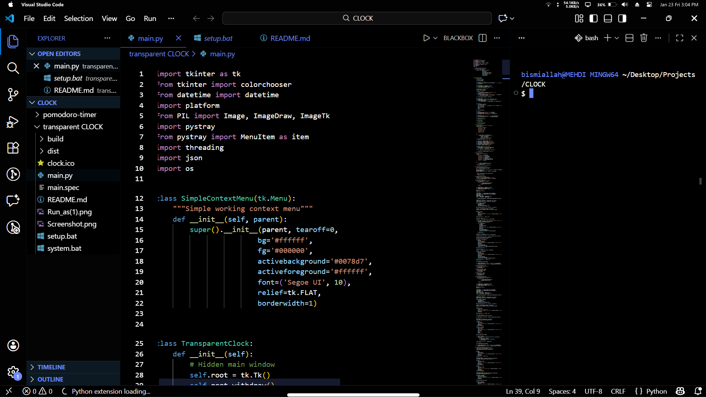

# ZENE Theme
I personaly use this them because i love see my editor simple and clean i dont like mush colors lets keep it simple

## Dark ZENE Theme
()

## Ice Theme
()

## Installation

1. Open **Extensions** sidebar panel in Visual Studio Code. `View → Extensions`
1. Search for `ZENE Theme`
1. Click **Install**
1. Click **Reload**
1. File > Preferences > Color Theme > **night-fall**
1. Optional: Use the recommended settings below for best experience

## Authors
Authored by [Mehdi Talalha](https://instagram.com/ska_zene)

