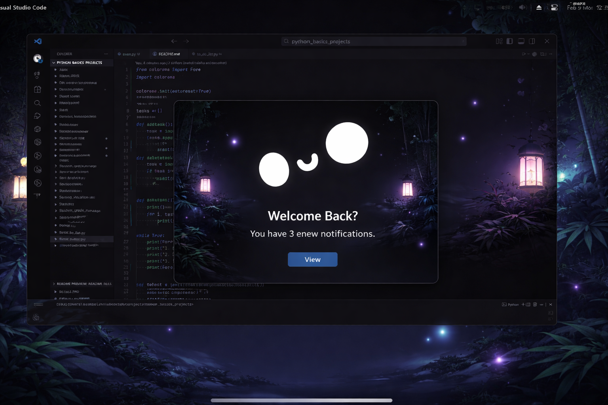
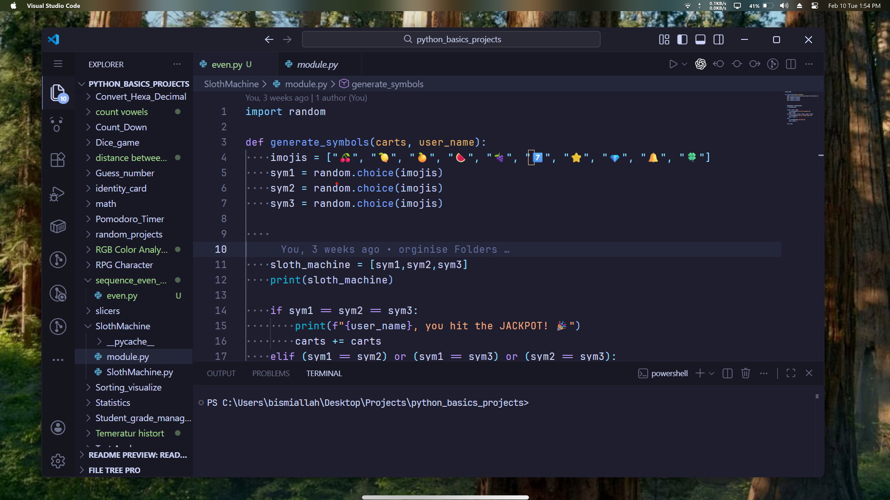

# [Zene Theme](https://marketplace.visualstudio.com/items?itemName=MehdiTalalha.zene-theme)
<p align="center">
  
  
  [](https://vscode.dev/theme/MehdiTalalha.zene-theme)
</p>


## Zene Theme Preview

Zene Dark Theme



Zene Light Theme


---

## Recommended Settings
```json
{
  "workbench.colorTheme": "Zene Dark Theme", // or "zene light theme if you prefer light theme
  "editor.fontFamily": "JetBrains Mono, Consolas, 'Courier New', monospace",
  "editor.fontSize": 14,
  "editor.lineHeight": 1.6,
  "editor.fontWeight": "400",
  "editor.letterSpacing": 0.5,
  "editor.fontLigatures": true,
  "editor.bracketPairColorization.enabled": false,
  "editor.showUnused": false,
  "editor.cursorBlinking": "smooth",
  "editor.wordWrap": "on"
}
```
---

## Installation

1. Open **Extensions** sidebar panel in Visual Studio Code. `View → Extensions`
2. Search for `Zene Theme`
3. Click **Install**
4. Click **Reload**
5. Go to `File > Preferences > Color Theme > **Zene Dark Theme**`
6. Enjoy beautiful coding with Zene Theme!

## 👨‍💻 Authors
Authored by [Mehdi Talalha](https://instagram.com/ska_zene)

---

# Enjoy! 😊

