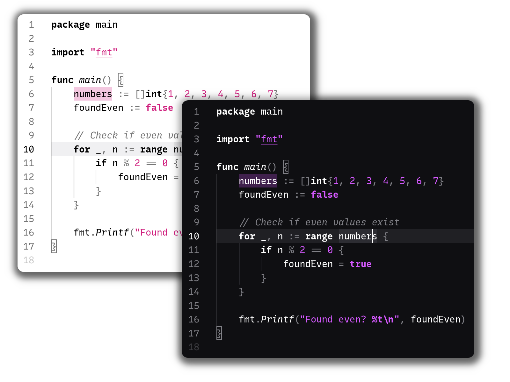

# [ZENE Theme](https://marketplace.visualstudio.com/items?itemName=MehdiTalalha.zene-theme)
[](https://vscode.dev/theme/MehdiTalalha.zene-theme/ZENE%20Thme)

**Fun Fact:** I personaly use monochrome theme because i love see my editor simple and clean i dont like mush colors lets keep it simple.

## Screenshots


Font used in the screenshots is [JetBrains Mono.](https://www.jetbrains.com/lp/mono/)


## Recommended Settings
For the best experience with ZENE themes, add these settings to your settings.json:

```JSON
{
  "editor.fontFamily": "'Fira Code', 'JetBrains Mono', 'Cascadia Code', Consolas, 'Courier New', monospace",
  "editor.fontSize": 14,
  "editor.fontLigatures": true, 
  "editor.lineHeight": 1.6,
  "editor.letterSpacing": 0.5,

  "editor.cursorBlinking": "smooth",
  "editor.cursorSmoothCaretAnimation": "on",
  "editor.cursorWidth": 2,

  "editor.bracketPairColorization.enabled": true,
  "editor.guides.bracketPairs": true,
  "editor.guides.bracketPairsHorizontal": "active",
  "editor.guides.highlightActiveIndentation": true,

  "editor.renderIndentGuides": true,
  "editor.guides.indentation": true,

  "editor.renderWhitespace": "boundary", 
  "editor.lineNumbers": "on",
  "editor.renderLineHighlight": "all", 
  "editor.minimap.enabled": true,
  "editor.minimap.renderCharacters": false,
  "editor.minimap.maxColumn": 80,

  "editor.scrollbar.verticalScrollbarSize": 10,
  "editor.scrollbar.horizontalScrollbarSize": 10,

  "editor.smoothScrolling": true,
  "workbench.list.smoothScrolling": true,
  "terminal.integrated.smoothScrolling": true,

  "workbench.editor.tabCloseButton": "right",
  "workbench.editor.tabSizing": "shrink",
  "workbench.editor.highlightModifiedTabs": true,

  "workbench.activityBar.location": "default", 
  "workbench.sideBar.location": "left",
  "workbench.tree.indent": 16,
  "workbench.tree.renderIndentGuides": "always",

  "terminal.integrated.fontSize": 13,
  "terminal.integrated.lineHeight": 1.4,
  "terminal.integrated.cursorBlinking": true,
  "terminal.integrated.cursorStyle": "line",
  "terminal.integrated.fontFamily": "'Fira Code', 'JetBrains Mono', monospace",
  
  "workbench.productIconTheme": "material-product-icons",

  "editor.semanticHighlighting.enabled": true,

  "workbench.colorCustomizations": {},

  "breadcrumbs.enabled": true,
  "breadcrumbs.symbolPath": "on",

  "git.decorations.enabled": true,
  "scm.diffDecorationsGutterWidth": 3,

  "editor.peekWidgetDefaultFocus": "editor",

  "editor.suggest.preview": true,
  "editor.suggestSelection": "first",

  "files.watcherExclude": {
    "**/.git/objects/**": true,
    "**/.git/subtree-cache/**": true,
    "**/node_modules/*/**": true
  },

  "telemetry.telemetryLevel": "off",

  "editor.formatOnSave": false,
  "editor.formatOnPaste": false,

  "editor.wordWrap": "off", 

  "zenMode.centerLayout": true,
  "zenMode.hideLineNumbers": false,
  "zenMode.silentNotifications": true
}

```

## Installation

1. Open **Extensions** sidebar panel in Visual Studio Code. `View → Extensions`
1. Search for `ZENE Theme`
1. Click **Install**
1. Click **Reload**
1. File > Preferences > Color Theme > **Simple Black Theme**
1. Optional: Use the recommended settings below for best experience

## Authors
Authored by [Mehdi Talalha](https://instagram.com/ska_zene)


